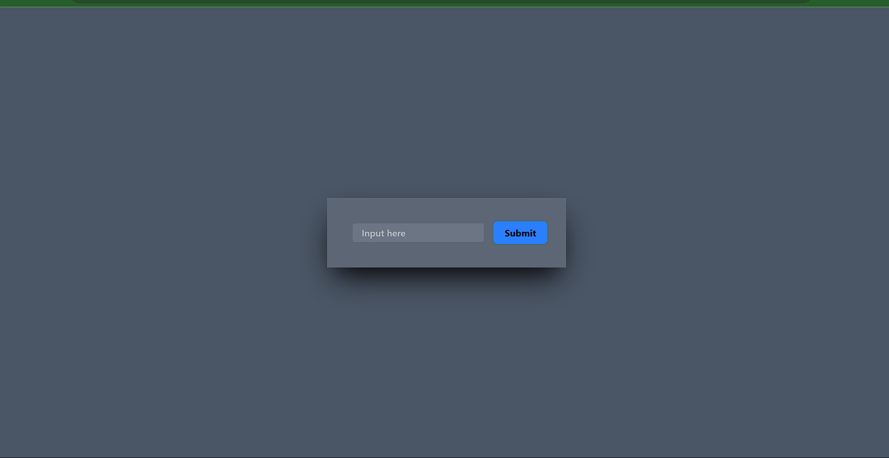
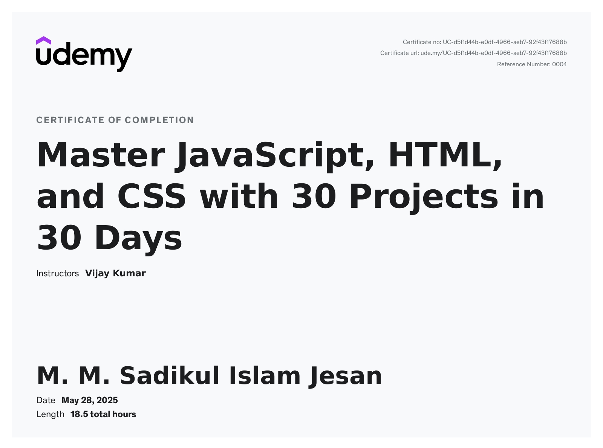

# JavaScript 30 Projects in 30 Days 🚀

A collection of 30 hands-on JavaScript projects built in 30 days to master web development fundamentals. Each project focuses on practical implementation of JavaScript, HTML, and CSS concepts.



## 📚 Course Overview

This repository contains 30 unique projects that helped me master JavaScript, HTML, and CSS through practical implementation. Each project is designed to reinforce different aspects of web development while building real-world applications.

### 🎯 What You'll Learn
- JavaScript fundamentals and advanced concepts
- DOM manipulation and event handling
- CSS animations and transitions
- Responsive web design
- Local storage and data management
- API integration
- Form validation
- Modern UI/UX practices

## 🛠️ Projects List

1. [Invalid Input Shake](Day%201%20Invalid%20Input%20Shake/) - Input validation with shake animation
2. [Box Shadow Generator](Day%202%20Box%20Shadow%20Generator/) - CSS box shadow generator tool
3. [Notes Application](Day%203%20Notes%20Application/) - Notes app with local storage
4. [FD Calculator](Day%204%20FD%20Calculator/) - Fixed Deposit calculator
5. [Gradient Generator](Day%205%20Gradient%20Generator/) - CSS gradient generator
6. [BMI Calculator](Day%206%20BMI%20Calculato/) - Body Mass Index calculator
7. [Tip Calculator](Day%207%20Tip%20Calculator/) - Bill splitting and tip calculator
8. [Blob Maker](Day%208%20Blob%20Maker/) - Customizable blob shape generator
9. [Basic Image Editor](Day%209%20Basic%20Image%20Editor/) - Simple image editing tool
10. [Input Character Counter](Day%2010%20Input%20Character%20Counter/) - Character and word counter
11. [Image Slider](Day%2011%20Image%20Slider/) - Smooth image slider with controls
12. [Day of the Week](Day%2012%20Day%20of%20the%20Week/) - Day calculator for any date
13. [Live Word Counter](Day%2013%20Live%20Word%20Counter/) - Real-time word counter
14. [Video Slider](Day%2014%20Video%20Slider/) - Video slider with thumbnails
15. [Get Unicode Value](Day%2015%20Get%20Unicode%20Value/) - Unicode character finder
16. [Dictionary Application](Day%2016%20Dictionary%20Application/) - Word definitions and examples
17. [Paragraph Generator](Day%2017%20Paragraph%20Generator/) - Random paragraph generator
18. [CSS Changer Application](Day%2018%20CSS%20Changer%20Application/) - Real-time CSS preview
19. [Robot Joke Generator](Day%2019%20Robot%20Joke%20Generator%20Application/) - Robot-themed jokes
20. [Star Rating Project](Day%2020%20Star%20Rating%20Project/) - Interactive star rating system
21. [Random Password Generator](Day%2021%20Generate%20Random%20Password/) - Secure password generator
22. [Random Number Generator](Day%2022%20Random%20Number%20Generator/) - Custom range number generator
23. [Prime Number Checker](Day%2023%20Prime%20and%20Non-Prime%20Number/) - Prime number validator
24. [Counter Application](Day%2024%20Counter%20Application/) - Increment/decrement counter
25. [Age Calculator](Day%2025%20Age%20Calculator/) - Age calculation tool
26. [Date and Time Widget](Day%2026%20Date%20and%20Time%20Widget/) - Current date/time display
27. [Advanced Image Carousel](Day%2027%20Advanced%20Image%20Carousel%20Application/) - Enhanced image carousel
28. [Code Editor](Day%2028%20Code%20Editor/) - Simple code editor
29. [Poll System](Day%2029%20Poll%20System/) - Interactive polling system
30. [Cash Calculator](Day%2030%20Cash%20Calculator/) - Expense and income tracker

## 🎓 Course Completion



## 🚀 Getting Started

1. Clone the repository:
```bash
git clone https://github.com/yourusername/javascript-30-projects.git
```

2. Navigate to any project directory:
```bash
cd "Day X Project Name"
```

3. Open `index.html` in your browser to view the project.

## 🛠️ Technologies Used

- HTML5
- CSS3
- JavaScript (ES6+)
- Local Storage API
- Tailwind CSS
- Font Awesome Icons

## 📱 Features

- Responsive design for all screen sizes
- Modern UI/UX implementation
- Interactive elements and animations
- Real-time data processing
- Local storage integration
- Cross-browser compatibility

## 🤝 Contributing

Contributions, issues, and feature requests are welcome! Feel free to check the [issues page](https://github.com/yourusername/javascript-30-projects/issues).

## 📝 License

This project is licensed under the MIT License - see the [LICENSE](LICENSE) file for details.

## 👨‍💻 Author

Your Name
- GitHub: [@yourusername]([https://github.com/yourusername](https://github.com/SJesan))
- LinkedIn: [Your LinkedIn]([https://linkedin.com/in/yourusername](https://www.linkedin.com/in/sadikul-islam-jesan/))

## 🙏 Acknowledgments

- Inspired by various web development challenges
- Thanks to all the open-source communities
- Special thanks to the JavaScript community for their amazing resources

---
⭐️ If you like this project, please give it a star on GitHub! 
